# Agent-Based-Modeling

Welcome to `ClubLife` where crowddynamics and agent-based-modelling meet. In this repository you will find lots of run files in its root directory. These run files all refer to files that are either within the ClubLife, ClubLife_no_walls or mesa_own folders. This distinction has been done to be able to run different scenario's of the model, without ever changing parameters within the code.

In the figures folder, all the outcomes of the experiments are shown (the output of all the exp\*.py files.) Furthermore there is a two part reason for the Mesa library to be loaded in locally. The first is because this nullifies the need for a used to download mesa through pip. And second but most important, the standard JavaScript and HTML templates that are usually used by Mesa did not meet our demands, so changes within the source code of the Mesa library were made. Especially within the modular_template.html file.

| Variable | Funnel | No Walls |
| ---- | ----------------- | -------------------|
| Floor PLans|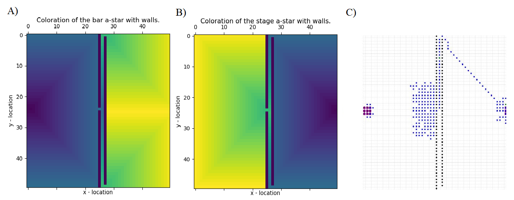|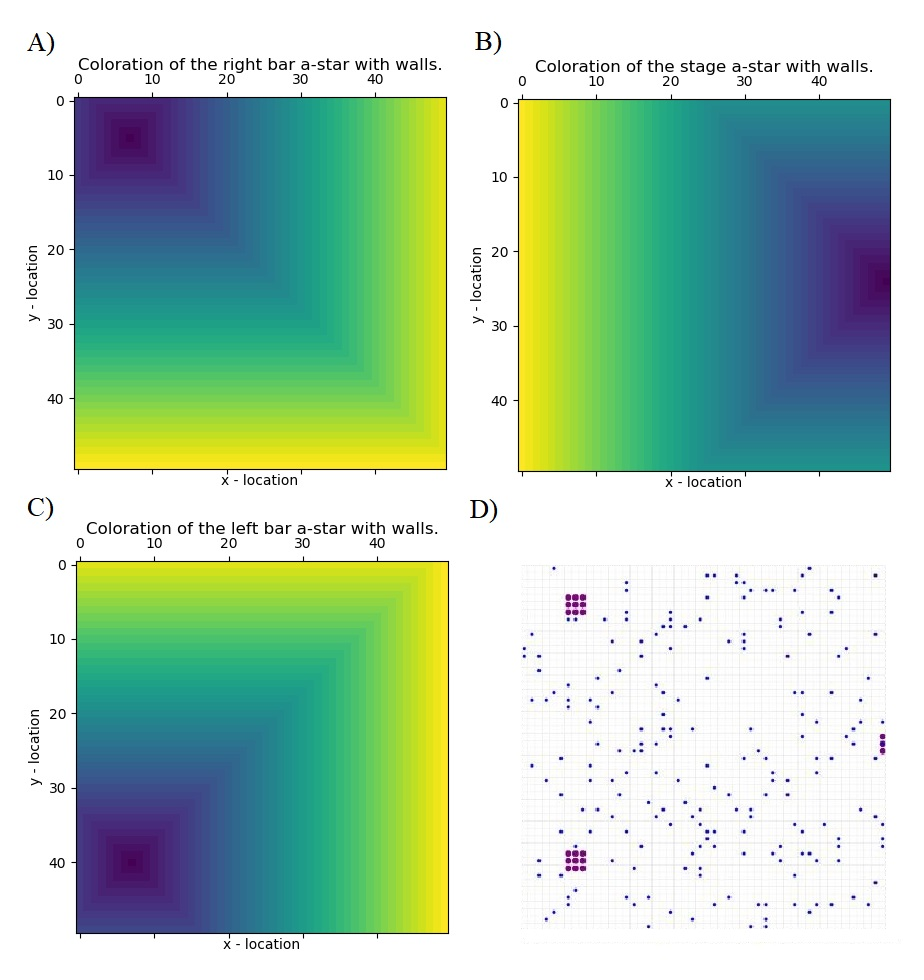|
| Density Coefficient | 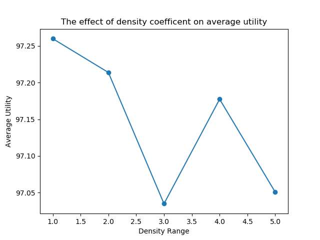 | 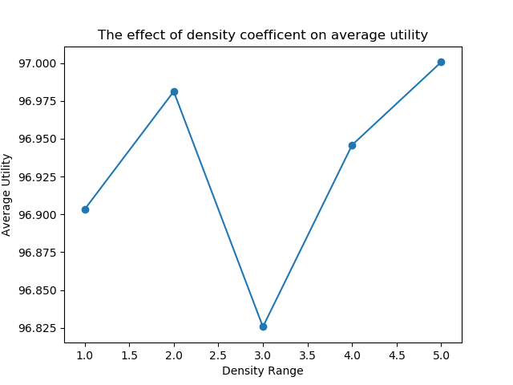|
| Density Coefficient Big Range | 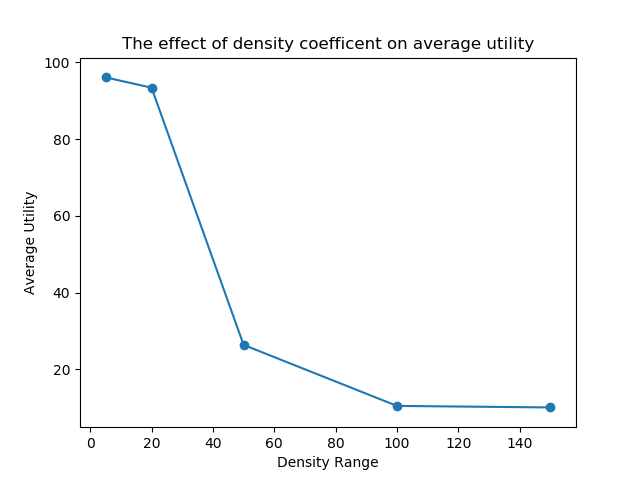 | 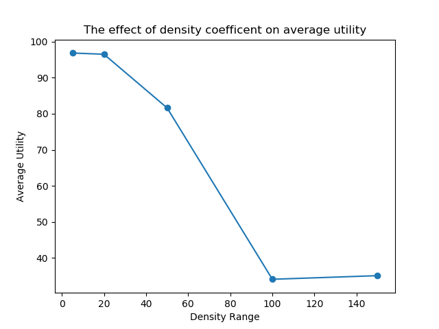|
| Number of Agents | 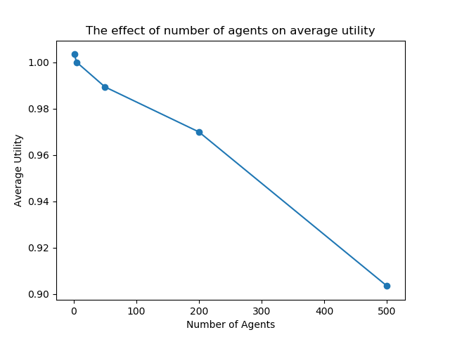 | 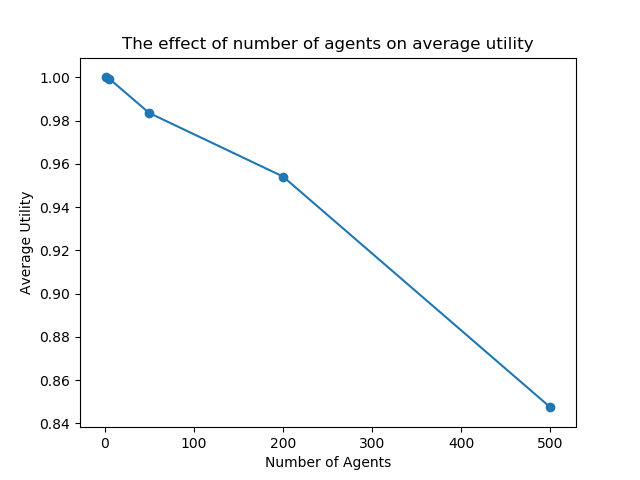|
| Vision | 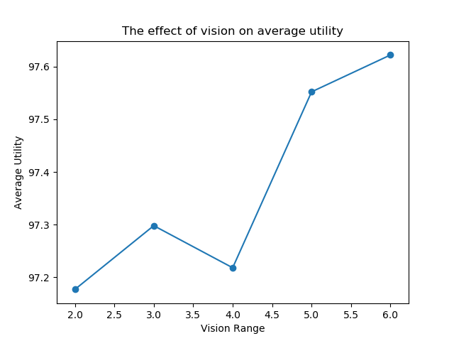 | 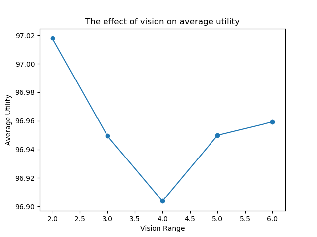|
| All of the above |  | 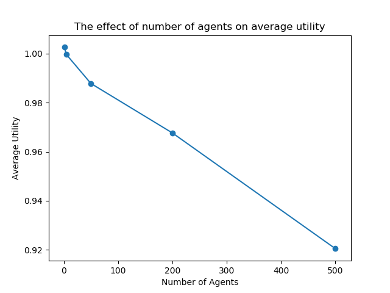|

<!-- | Floor PLans |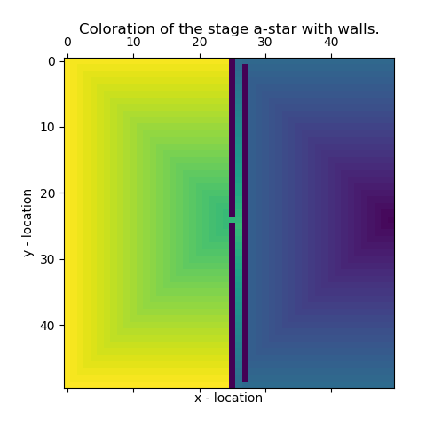  |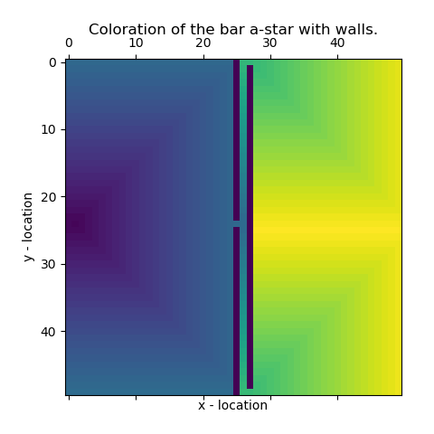  |
| Floor PLans | 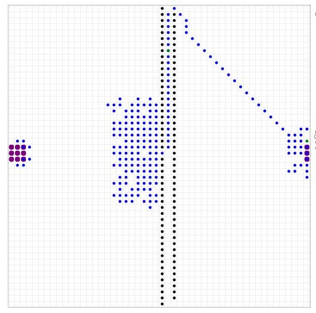  |  |
| Floor PLans |  |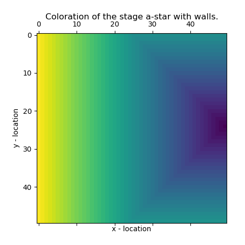  |
| Floor PLans |  |   | -->